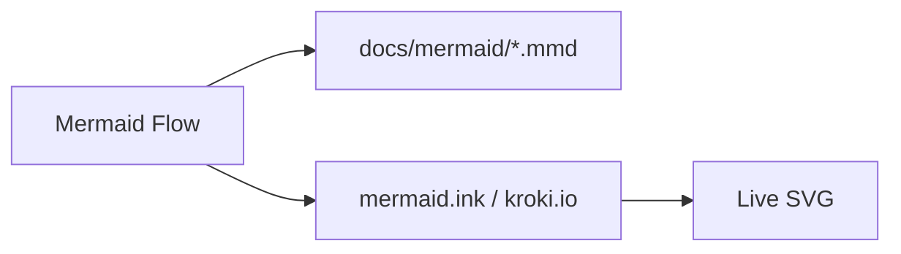

# Mermaid Flow

Mermaid Flow is a Hermes Desktop plugin for editing Mermaid diagrams as ordinary project files and previewing them live. Keep architecture, API, and UX flows next to the code instead of in a separate drawing tool.

---

<div align="center">
    
</div>

---

- **Project-backed.** Default folder `{cwd}/docs/mermaid`, overridable per project.
- **Live preview.** Remote SVG via `mermaid.ink`, then `kroki.io`.
- **Split workflow.** Source | split | preview with a draggable sash.
- **Editor.** Syntax highlight, Mermaid completions, history, line cut/copy/delete/duplicate.
- **Canvas.** Pan, wheel zoom to cursor, double-click fit.
- **Formats.** Writes `*.mmd`; also reads `*.md` and `*.mermaid`.
- **Autosave.** Debounced ~`550 ms`.

## Flow



## Install

Desktop loads `$HERMES_HOME/desktop-plugins/mermaid-flow/plugin.js` (folder name = `id`).

```sh
mkdir -p ~/.hermes/desktop-plugins
git clone https://github.com/TOwInOK/mermaid-flow.git ~/.hermes/desktop-plugins/mermaid-flow
```

Update / remove:

```sh
git -C ~/.hermes/desktop-plugins/mermaid-flow pull
rm -rf ~/.hermes/desktop-plugins/mermaid-flow
```

Local copy / symlink (dev):

```sh
mkdir -p ~/.hermes/desktop-plugins/mermaid-flow
cp -R . ~/.hermes/desktop-plugins/mermaid-flow/
# or: ln -sfn "$(pwd)" ~/.hermes/desktop-plugins/mermaid-flow
```

After install: **Reload desktop plugins** → open a project → sidebar **Mermaid Flow** (`Mod+Shift+M`).

## Requirements

- Hermes Desktop with `// @include` support in `runtime-loader` (includes expand before import).
- Network access to `mermaid.ink` or `kroki.io` for SVG preview.
- Allowed imports only: `@hermes/plugin-sdk`, `react`, `react/jsx-runtime` (no npm build step).

## Editor shortcuts

| Shortcut               | Action                                     |
| ---------------------- | ------------------------------------------ |
| `Ctrl/Cmd + X`         | Cut current line when nothing is selected  |
| `Ctrl/Cmd + C`         | Copy current line when nothing is selected |
| `Ctrl/Cmd + Shift + K` | Delete current line                        |
| `Ctrl/Cmd + D`         | Duplicate line / selection                 |
| `Tab`                  | Accept autocomplete suggestion             |
| `Ctrl/Cmd + Space`     | Open full completions                      |
| `Mod+Shift+M`          | Open Mermaid Flow                          |

## Storage

|                  |                                                    |
| ---------------- | -------------------------------------------------- |
| Default folder   | `{cwd}/docs/mermaid`                               |
| Files            | write `*.mmd`; read `*.mmd` / `*.md` / `*.mermaid` |
| Per-project path | Hermes storage keyed by `cwd`                      |
| Autosave         | ~`550 ms` debounce                                 |

Folder dialog:

- Relative path (from `cwd`) or absolute
- **Browse** — native picker
- **Reveal** — create folder if needed, open in file manager
- **Reset default** — restore `docs/mermaid`

## Source layout

```text
plugin.js                 # entry only: banner + // @include lines
src/
  00-runtime.js           # allowed imports + plugin storage handle
  10-constants.js         # storage keys, atoms, palettes, Mermaid catalogs
  20-file-utils.js        # paths, FS/source helpers, DnD, snapshot writer
  30-mermaid-language.js  # highlighting, transforms, completions
  40-editor.js            # DOM/React Mermaid editor
  50-svg-preview.js       # remote render, sanitize, sash, SVG camera
  60-flow-page.js         # React page orchestration and composition
  70-plugin-meta.js       # only plugin contract / export default
```

Include order (shared top-level scope after expand — not separate ESM modules):

```text
00-runtime.js → 10-constants.js → 20-file-utils.js → 30-mermaid-language.js
→ 40-editor.js → 50-svg-preview.js → 60-flow-page.js → 70-plugin-meta.js
```

The include order is the dependency order. Fragments are not ESM modules: Hermes Desktop expands whole-line `// @include ./rel.js` directives into one shared top-level scope before loading. Imports belong only in `00-runtime.js`; `70-plugin-meta.js` is the only fragment that exports the plugin contract.

## Development checks

```sh
for file in plugin.js src/*.js scripts/*.mjs; do node --check "$file"; done
node scripts/check-structure.mjs
node scripts/check-pure.mjs
```
